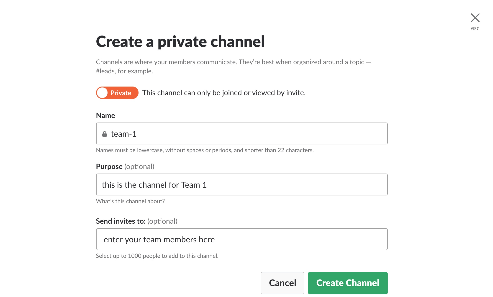

# hackathon

## Preparation for the Hack-a-thon
### Software
#### [Intellij](http://mdp.tylingsoft.com/)
It would be best if you use the ultimate edition.  While this requires a subscription, you can get a trial edition of the software for 30 days.

#### [Visual Studio Code](http://https://code.visualstudio.com) which is free with Graphviz extention
Instructions for how to set this up will be forthcoming

### Accounts Needed (if you dont already have these)
#### Github
Please create a github account for yourself (if you dont already have one)
##### Git Training Materials

#### Slack
We will use a specially created slack workspace called [nx-hackathon.slack.com](https://nx-hackathon.slack.com) for this event.

##### Slack How-to's
###### Creating a private channel for your team

